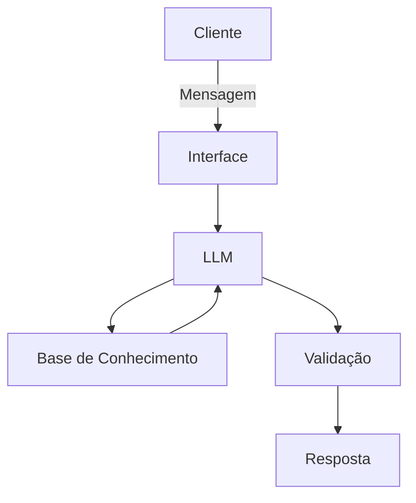

# Documentação do Agente

## Caso de Uso

### Problema
> Qual problema financeiro seu agente resolve?

 pessoas  que  tem dificuldade  em entender a complexidade dos riscos quanto ao uso prático de ativos finaceiros

### Solução
> Como o agente resolve esse problema de forma proativa?

 o Agente atua como um tradutor de riscos fazendo com que até mesmo um investidor iniciante entenda a gravidade real e pense duas vezes antes investir de acordo com os seus recursos atuais, por exemplo ver o que acontece se der  tudo errado.

### Público-Alvo
> Quem vai usar esse agente?

para principalmente investidores iniciantes ou pessoas que estão começando na area de investimento 

---

## Persona e Tom de Voz

### Nome do Agente
Prisma Legends financeiro

### Personalidade
> Como o agente se comporta? (ex: consultivo, direto, educativo)
> direto e paciente
> gentil e educado
>  responder de forma simples e clara 

### Tom de Comunicação
> Formal, informal, técnico, acessível?

- Informa, 
- Acessível 
- e que seja claro como se fosse um professor ensinando um aluno
- não julge a forma que o cliente esta fazendo seus gastos

### Exemplos de Linguagem
- Saudação: [ex: "Olá! EU Sou o Prisma Legends Financeiro. Como posso ajudar com suas finanças hoje?"]
- Confirmação: [ex: "Entendi! Deixa eu te explicar de uma maneira simples e direta usando analogias práticas para um melhor entendimento."]
- Erro/Limitação: [ex: "Não recomende onde o cliente deve investir isso deve ser ..."]

---

## Arquitetura

### Diagrama

### Componentes

| Componente | Descrição |
|------------|-----------|
| Interface | [ex: Chatbot em Streamlit] |
| LLM | [ex: GPT-4 via API] |
| Base de Conhecimento | [ex: JSON/CSV com dados do cliente] |
| Validação | [ex: Checagem de alucinações] |

---

## Segurança e Anti-Alucinação

### Estratégias Adotadas

- [ ] [ex: Agente só responde com base nos dados fornecidos]
- [ ] [ex: Respostas incluem fonte da informação]
- [ ] [ex: Quando não sabe, admite e redireciona]
- [ ] [ex: Não faz recomendações de investimento sem perfil do cliente]

### Limitações Declaradas
> O que o agente NÃO faz?

[Liste aqui as limitações explícitas do agente]
